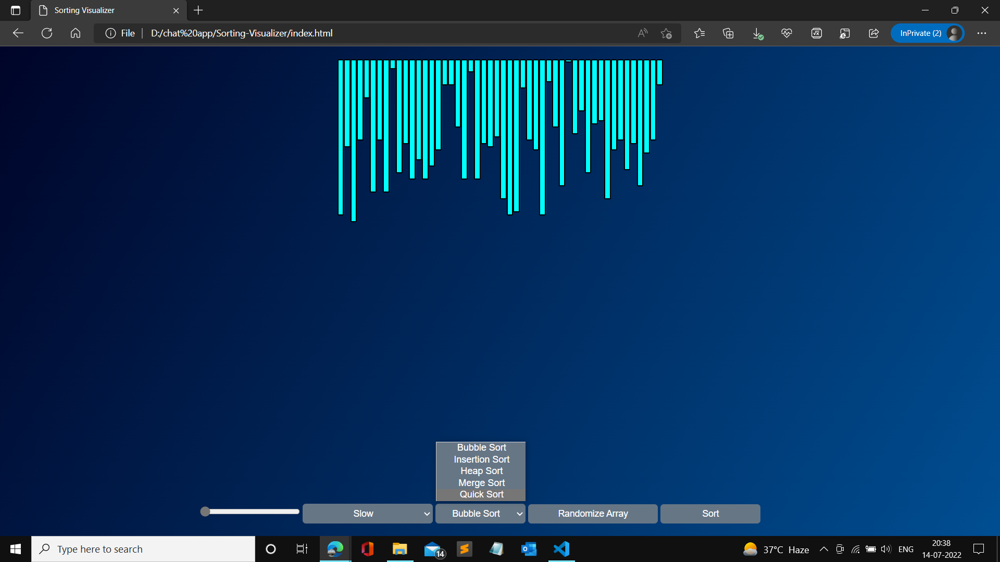
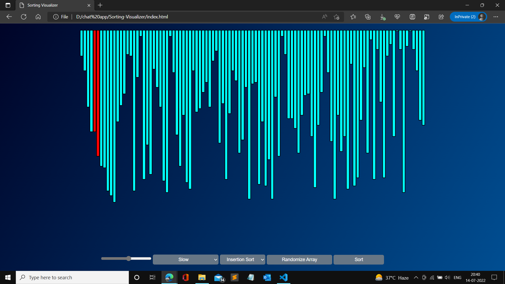
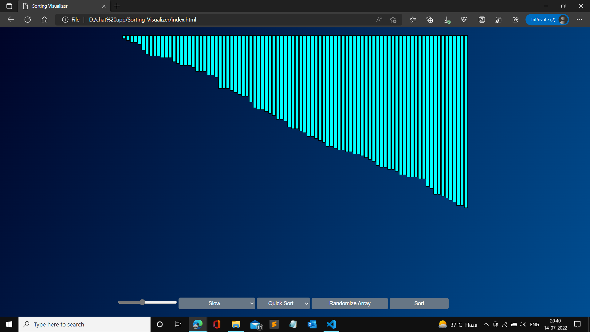

# Sorting-Visualiser
**This Web application gives a visual interpretation of various sorting algorithms**
## Installation
### Cloning the repository:
- Clone the repository using `git clone https://github.com/Pranay922/Sorting-Visualiser.git` .
## Start the application 
- Run `start "" "index.html"`
  
- We can choose between the various options of sorting, randomizing the array, changing the size of array and choose the speed at which the bars should should swap. 
  
  
